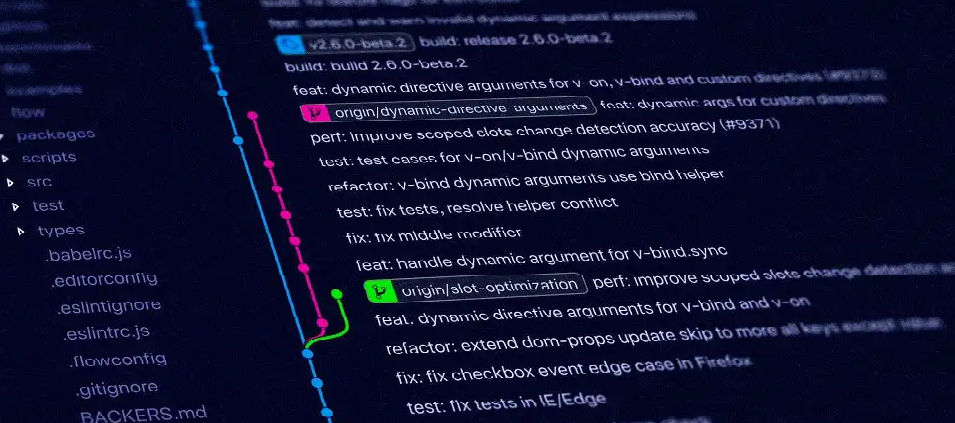
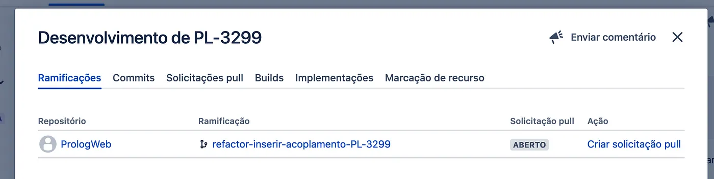
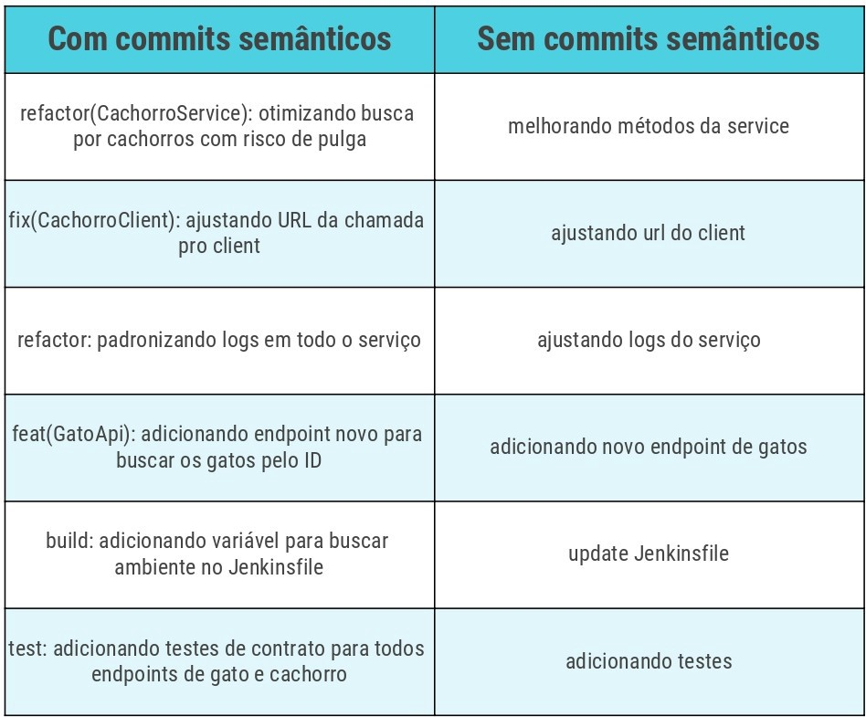
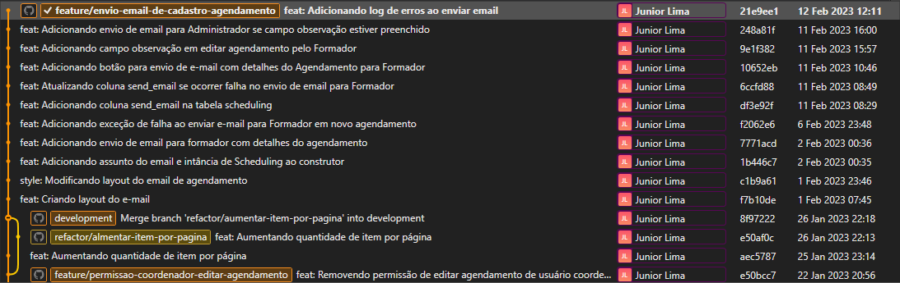
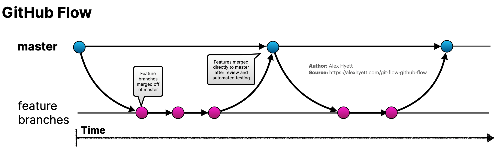
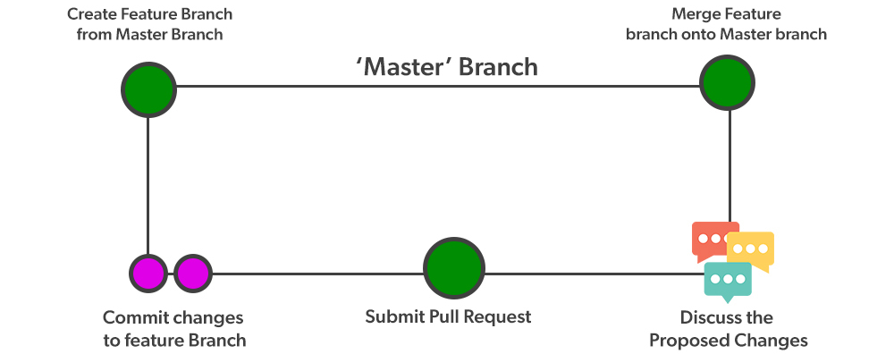
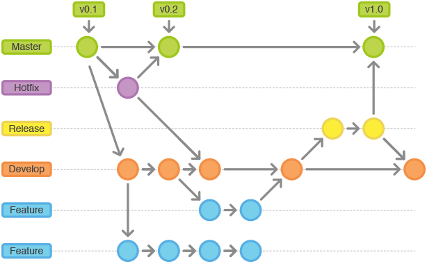
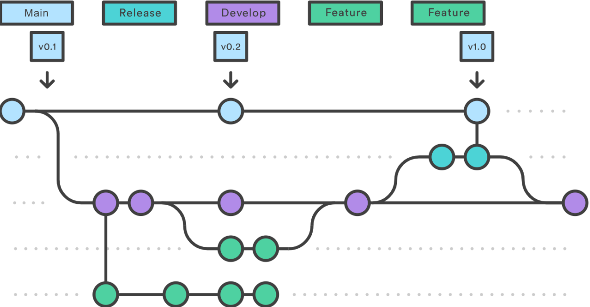

<p align="center" id="top">
    
</p>

<h1 align="center"> Padrões e Nomenclaturas no Git </h1>

<!-- > Padrão pra quê? Faz de qualquer jeito que da certo... -->

<p align="center">
    <a href="#branches">Padrões Branches</a> •
    <a href="#commits">Padrões Commits</a> •
    <a href="#fluxo-de-trabalho-com-git">Fluxo de Trabalho com GIT</a> •
    <a href="#ferramentas-para-gerenciamento-git">Ferramentas</a> •
    <a href="#referências">Referências</a> •
    <a href="#autor">Autor</a>
</p>

---

# Branches

## Padrões nos nomes de branches

Em termos de **padrões e nomenclaturas no Git**, esse ponto é importante mas não tão primordial assim. Mas acredito que é sempre sagaz ter um padrão de nomenclaturas e um nome explicativo nas branches.

Nomes de branches são compostos de 3 partes:

1 — Prefixos ou categoria do branch. Prefixos pré-definidos para criar uma branch, segue abaixo a lista:

* docs/ apenas mudanças de documentação;
* feature/ O nome já diz também o que é, uma nova feature que será adicionada ao projeto, componente e afins;
* fix/ a correção de um bug;
* perf/ mudança de código focada em melhorar performance;
* refactor/ mudança de código que não adiciona uma funcionalidade e também não corrigi um bug;
* style/ mudanças no código que não afetam seu significado (espaço em branco, formatação, ponto e vírgula, etc);
* test/ adicionar ou corrigir testes.
* improvement/ Uma melhoria em algo já existente, seja de performance, de escrita, de layout, etc.

2 — o que o branch faz em si.

3 — Código da tarefa no Jira. Ex.: SI20-348.

Exemplos de alguns nomes de branches que podem existir em nossa aplicação:

* docs/padronizacao-commits-branches-git-SI20-348
* feat/cadastro-veiculos-SI20-123
* refactor/edicao-colaboradores-SI20-355
* fix/busca-checklists-SI20-232

O código da tarefa no Jira é extremamente importante, ele ajuda autor e reviewer a localizarem o branch correto e também permite ao Jira linkar automaticamente um branch a uma tarefa, tornando o mesmo acessível a partir da tarefa:

<p align="center">
    
</p>

# Commits

## Por que eu devo escrever boas mensagens de commit?

* Uma mensagem de commit para o Git bem redigida é a melhor maneira de comunicar o contexto de uma alteração para outros desenvolvedores que estejam trabalhando no projeto. De fato, até para o seu "eu" do futuro.

* As mensagens de commit podem comunicar adequadamente o motivo de uma alteração ter sido feita. Entender isso torna o desenvolvimento e a colaboração mais eficazes.

Você já tentou executar o comando git log em um de seus projetos antigos para ver as mensagens de commit "estranhas" que você usava desde o início de um projeto? Pode ser difícil entender a razão pela qual algumas alterações foram feitas no passado. Você vai desejar ter lido esse artigo antes :).

## Como escrever boas mensagens de commit

Existem várias convenções usadas por equipes diferentes para escrever boas mensagens de commit. Descreverei aqui apenas algumas regras gerais e dicas para escrever mensagens de commit – você tem de decidir qual convenção deseja seguir. Se trabalha para uma empresa ou se contribui para o código aberto, é preciso se adaptar a convenção utilizada.

Algumas Convenções:

* [Conventional Commits](https://www.conventionalcommits.org/en/v1.0.0/) A especificação Conventional Commits é uma convenção leve sobre as mensagens de commit.
* [Angular Commit Message Guidelines](https://github.com/angular/angular.js/blob/master/DEVELOPERS.md#-git-commit-guidelines) Diretrizes de mensagem de confirmação Angular.
* [Udacity Git Commit](https://udacity.github.io/git-styleguide/) Udacity Git Commit Guia de estilo de mensagem
* [Styleguides](https://gist.github.com/crissilvaeng/dfb5b14f8eb2c25df4fd8a49f4f03252) Mensagens de commit styleguide.

Para criar um histórico de revisão útil, as equipes primeiro devem concordar quanto a uma convenção a ser utilizada nas mensagens de commit. Isso também se aplica a projetos pessoais.

## Padrões nos nomes dos Commits

Estrutura para um commit:

```javascript
<type>(<scope>): <subject>
<BLANK LINE>
<body>
<BLANK LINE>
<footer>
```

Vamos dissecá-la:

1 — type ou prefixos do commit: podem ser os mesmos utilizados para criar branches.

2 — scope: onde a alteração foi feita. Aqui, criamos nossos próprios scopes que, na maioria dos casos, refletem o nome de uma funcionalidade.

3 — subject: um resumo do commit. Deve utilizar o imperativo, como: faz, adiciona, altera, muda e etc.

4 — body: espaço utilizado para detalhar o que foi feito. É opcional.

5 — footer: onde colocamos as PLs (códigos das tarefas no Jira) e também alguma breaking change.

Onde tem `<BLANK LINE>` significa que temos que deixar uma linha em branco.

## Prefixos dos Commits

* docs: apenas mudanças de documentação;
* feat: O nome já diz também o que é, uma nova feature que será adicionada ao projeto, componente e afins;
* fix: a correção de um bug;
* perf: mudança de código focada em melhorar performance;
* refactor: mudança de código que não adiciona uma funcionalidade e também não corrigi um bug;
* style: mudanças no código que não afetam seu significado (espaço em branco, formatação, ponto e vírgula, etc);
* test: adicionar ou corrigir testes.
* improvement: Uma melhoria em algo já existente, seja de performance, de escrita, de layout, etc.

## Exemplo na prática

Aqui vou exemplificar uma sequência de alguns commits, comparando e mostrando a diferença entre apenas commitar e commitar usando commits semânticos:

<p align="center"><sub>Exemplo de commit semantico</sub></p>

<p align="center">
    
</p>

<p align="center">
    
</p>

### Conclusão

A parte mais importante de uma mensagem de commit é o fato de que ela deve ser clara e significativa. No final, escrever boas mensagens de commit demonstra que você é um bom colaborador. Os benefícios de escrever boas mensagens de commit não se limitam apenas à sua equipe, mas se estendem a você mesmo e a colaboradores no futuro.

# Fluxo de trabalho com Git

Uma dúvida muito comum a quem começa a usar o Git de maneira mais ativa é como organizar as branches, afinal, são muitos os problemas que um projeto pode enfrentar: De bugs urgentes que devem ser corrigidos, a criação de inúmeras features em conjunto com releases agrupando os deploys relativos a essas features.

Mas...como organizar tudo?

## Artigo com conceito sobre a metodologia de trabalho e organização

* [Comparando fluxos de trabalho do Git](https://www.atlassian.com/br/git/tutorials/comparing-workflows) Este artigo compara fluxos de trabalho do Git: o que você deve saber.

## GitHub Flow

* [GitHub Flow](https://docs.github.com/pt/get-started/quickstart/github-flow) O fluxo de GitHub é um fluxo de trabalho leve e baseado no branch.

<p align="center">
    
</p>

<p align="center">
    
</p>

## Gitflow

O Gitflow é um modelo alternativo de ramificação do Git que consiste no uso de ramificações de recursos e várias ramificações primárias.

* [Git - GitFlow, usar ou não usar?](https://codigomaromba.com/2019/01/02/git-gitflow-usar-ou-nao-usar/) Este artigo aborda o conceito sobre a metodologia de trabalho e organização do Git Flow.
* [Git Flow](https://fjorgemota.com/git-flow-uma-forma-legal-de-organizar-repositorios-git/) Uma forma legal de organizar repositórios git.
* [Fluxo de trabalho de Gitflow](https://www.atlassian.com/br/git/tutorials/comparing-workflows/gitflow-workflow) O Gitflow é um modelo alternativo de ramificação do Git
* [Git Flow - Alura](https://www.alura.com.br/artigos/git-flow-o-que-e-como-quando-utilizar) entenda o que é, como e quando utilizar.

<p align="center">
    
</p>

## Trunk-based Development (Desenvolvimento Baseado em Tronco)

O desenvolvimento baseado em tronco segue um ritmo rápido para entregar código à produção. Se o desenvolvimento baseado em tronco fosse como música, seria um staccato rápido — notas curtas e sucintas em rápida sucessão, com os commits de repositório sendo as notas. Manter commits e ramificações pequenas permite um ritmo mais rápido de merges e implementações.

Pequenas mudanças de um par de commits ou modificação de algumas linhas de código minimizam a sobrecarga cognitiva. É muito mais fácil para as equipes terem conversas significativas e tomar decisões rápidas ao revisar uma área limitada de código versus um conjunto extenso de alterações.

* [Youtube Alura - Git Flow vs Desenvolvimento baseado em tronco](https://youtu.be/0jw8RpHuZ-Q) Git Flow vs Desenvolvimento baseado em tronco.
* [Desenvolvimento baseado em tronco x Gitflow](https://forum.casadodesenvolvedor.com.br/topic/44817-trunk-based-development-x-gitflow/) Saiba por que essa prática de gerenciamento de controle de versão é prática comum entre as equipes de DevOps.
* [Atlassian - Desenvolvimento baseado em tronco](https://www.atlassian.com/br/continuous-delivery/continuous-integration/trunk-based-development) Saiba por que essa prática de gerenciamento de controle de versão é prática comum entre as equipes de DevOps.

* Principais características do trunk based development (desenvolvimento baseado em tronco)
  * As ramificações devem ter ciclos de vida curto, ficando sempre perto da ramificação principal.
  * Ter três ou menos ramificações ativas no repositório de código do aplicativo
  * A ramificação principal sempre precisa estar em estado de pronto para deploy em produção.
  * Permite a integração e revisão contínua de código.
  * Realizar revisões de código assíncronas.
  * Permite versões consecutivas de código de produção.
  * Os hotfixes precisam ser criados a partir da ramificação principal e serem devolvidos à ramificação principal.
  * Recomendado para aplicações: Micros serviços, single page application, Prova de conceito (POC), Sistemas distribuídos.
  * É preciso ter um processo de integração contínua, com etapas de testes automatizados e validadores de qualidade de código.
  * Desenvolvimento baseado em troncos e CI/CD.

O desenvolvimento baseado em tronco é hoje em dia o padrão para equipes de engenharia de alto desempenho, pois define e mantém uma cadência de lançamento de software usando uma estratégia simplificada de ramificação do Git. Além disso, o desenvolvimento baseado no central oferece às equipes de engenharia mais flexibilidade e controle sobre como entregam software para o usuário final.

<p align="center">
    
</p>

---

## Ferramentas para gerenciamento GIT

* Padronização Commits
  * [Conventional Commits](https://marketplace.visualstudio.com/items?itemName=vivaxy.vscode-conventional-commits) Esta extensão do VS Code ajuda você a preencher a mensagem de commit de acordo com os [commits convencionais](https://www.conventionalcommits.org/en/v1.0.0/).
  * [Commitizen CLI](https://github.com/commitizen/cz-cli) ou [Commitlint CLI](https://github.com/conventional-changelog/commitlint) Ao fazer um commit com o Commitizen ou Commitlint, você será solicitado a preencher todos os campos de commit obrigatórios no momento do commit.

* Changelog
  * [Changelog Generator](https://marketplace.visualstudio.com/items?itemName=axetroy.vscode-changelog-generator) Extensão do VS Code para gerar changelog.
  * [Vscode Whatchanged](https://github.com/release-lab/vscode-whatchanged) Extensão do VS Code para gerar changelog.
  * [Changelog Snippets](https://marketplace.visualstudio.com/items?itemName=dzgmelody.vscode-changelog-snippets) Extensão do VS Code com snippets de changelog.
  * [Keep a Changelog](https://marketplace.visualstudio.com/items?itemName=RLNT.keep-a-changelog) Extensão do VS Code com snippets de changelog.

* Versionamento
  * [Versionamento Semântico 2.0.0](https://semver.org/lang/pt-BR/) Como uma solução para este problema proponho um conjunto simples de regras e requisitos que ditam como os números das versões são atribuídos e incrementados.

* Clientes Git GUI
  * [Lista de Clientes Git GUI](https://www.hostinger.com.br/tutoriais/git-gui) Os Melhores Clientes Git GUI para Windows, Linux e Mac.
  * [Git History](https://marketplace.visualstudio.com/items?itemName=donjayamanne.githistory) Extensão do VS Code, Histórico do Git, pesquisa e mais (incluindo git log).
  * [Git Graph](https://marketplace.visualstudio.com/items?itemName=mhutchie.git-graph) Extensão do VS Code, Visualize um Git Graph do seu repositório e execute facilmente as ações do Git a partir do gráfico.
  * [SourceTree](https://www.sourcetreeapp.com/) Simplicidade e poder em uma bela GUI Git para Mac e Windows (Atlassian).
  * [Git Fork](https://git-fork.com/) Um cliente git rápido e amigável para Mac e Windows.
  * [GitKraken](https://www.gitkraken.com/) Inclui uma GUI Git intuitiva e uma poderosa CLI Git para Linux, Mac e Windows.

## Referências

* [Git How To](https://githowto.com/pt-BR) é um tour guiado que passa pelos fundamentos de Git, inspirado pela premissa que saber sobre algo é fazê-lo.
* [Padrões e nomenclaturas no Git](https://www.brunodulcetti.com/padroes-e-nomenclaturas-no-git/) Como você cria suas branches? E seus commits? Possui padrões? [Bruno Dulcetti](https://github.com/dulcetti) 👏🏻👏🏻
* [Commitizen](https://github.com/commitizen/cz-cli) Ao confirmar com o Commitizen, você será solicitado a preencher todos os campos de confirmação obrigatórios no momento do commit.
* [Nomenclatura para repositórios](https://qastack.com.br/programming/11947587/is-there-a-naming-convention-for-git-repositories) Existe uma convenção de nomenclatura para repositórios git?
* [Como escrever boas mensagens de commit](https://www.freecodecamp.org/portuguese/news/como-escrever-boas-mensagens-de-commit-um-guia-pratico-do-git/) Como escrever boas mensagens de commit: um guia prático do Git
* [Tudo o que você precisa saber sobre commits semânticos](https://ilegra.com/blog/tudo-o-que-voce-precisa-saber-sobre-commits-semanticos/) Como seguir boas práticas de versionamento de código!
* [Prolog - Padrões de nomenclatura para branches e commits](https://medium.com/prolog-app/nossos-padr%C3%B5es-de-nomenclatura-para-branches-e-commits-fade8fd17106) Nossos padrões de nomenclatura para branches e commits
* [Conventional Commits](https://www.conventionalcommits.org/en/v1.0.0/) A especificação Conventional Commits é uma convenção leve sobre as mensagens de commit.
* [Git - GitFlow, usar ou não usar?](https://codigomaromba.com/2019/01/02/git-gitflow-usar-ou-nao-usar/) Este artigo aborda o conceito sobre a metodologia de trabalho e organização do Git Flow.
* [Git Flow](https://fjorgemota.com/git-flow-uma-forma-legal-de-organizar-repositorios-git/) Uma forma legal de organizar repositórios git.

### Autor

> Made with 💙 by JUNIOR LIMA 👋 <a href="https://www.linkedin.com/in/JuniorLima22/" target="_blank">See my LinkedIn</a> • GitHub <a href="https://github.com/JuniorLima22" target="_blank">@JuniorLima22</a>

<p align="center">
<sub><a href="#top" align="center">↑ voltar para o topo ↑</a></sub>
</p>